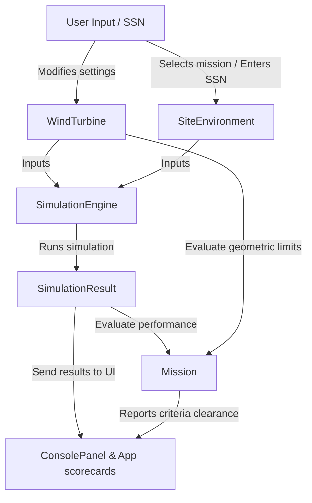

# Wind Power Simulator

A modular and educational CustomTkinter application for the simulation, dimensioning, and analysis of wind turbines. The tool is designed to teach students fundamental physical, mechanical, and economic trade-offs in wind energy engineering through gamified missions and personal-identity-number-based (SSN) parameter generation.

---

## Architecture & Data Flow

The system is built using **Domain-Driven Design (DDD)** principles to separate data from calculation logic and the user interface. This structure prevents code duplication and simplifies automated testing.



### 1. Domain Models (`src/wec_visualisation/models/`)
* **`WindTurbine`**: Represents the wind turbine geometry (rotor diameter, hub height, tower top/base diameters, wall thickness, solidity, blade count) and the selected drivetrain components (gearbox and generator).
* **`SiteEnvironment`**: Contains location-specific resources (average wind speed, surface roughness, survival gust, Weibull shape parameters) and economic rules (electricity price, green certificates, interest rate, inflation rate, lifetime). It also features an integrated social security number parser (`SSNGenerator`) to generate deterministic environmental conditions in Sandbox mode.
* **`SimulationResult`**: An immutable (`frozen=True`) dataclass containing all computed values from the simulation (AEP, capacity factor, structural forces, utilization rates, detailed CAPEX/OPEX components, and NPV cash flows).
* **`Mission`**: Defines individual missions, their descriptions, and a list of `Constraint` objects to evaluate turbine designs against specified criteria.

### 2. Calculation Engine & Services (`src/wec_visualisation/models/simulation.py`)
* **`SimulationEngine`**: A stateless engine that executes the simulation by delegating tasks to three specialized service classes:
  1. **`ClimateService`**: Calculates the average wind speed at hub height using logarithmic wind shear formulas and constructs the Weibull distribution of wind speed operational hours.
  2. **`EnergyService`**: Integrates the turbine's power curve (taking Betz limits and interpolated coefficient of performance $C_p$ into account) to compute the Annual Energy Production (AEP) and capacity factor.
  3. **`StructuralService`**: Computes aerodynamic and survival storm loads on the tower, estimates the Rotor Nacelle Assembly (RNA) mass, and performs structural limit state evaluations: **Breaking Utilization** (bending stress vs. a 235 MPa steel yield strength) and **Buckling Utilization** (compressive and bending buckling risk using NASA SP-8007 imperfection reductions).
  4. **`FinancialService`**: Computes capital expenditure (CAPEX) allocations (devex, rotor, drivetrain, tower, foundation, installation), annual operating costs (OPEX), revenues, Internal Rate of Return (IRR), and Net Present Value (NPV) profit margins over the turbine's lifetime.

---

## File Structure

The project code is organized inside `src/wec_visualisation/` as follows:

```text
uu_proj/
├── pyproject.toml              # Dependency management and project configuration (uv/pip)
├── README.md                   # This documentation file
└── src/
    └── wec_visualisation/
        ├── main.py                 # Application entry point
        ├── config.py               # Central physical and economic constants
        │
        ├── models/                 # --- DOMAIN & CALCULATION MODELS ---
        │   ├── turbine.py          # Turbine model, drivetrain specs, and geometric calculations
        │   ├── environment.py      # Site parameters, default scenarios, and SSNGenerator
        │   ├── simulation.py       # Climate, energy, structure, and finance services
        │   └── mission.py          # Mission and constraint evaluation logic (Constraint & Mission)
        │
        ├── gui/                    # --- CUSTOMTKINTER LAYOUT (MVC) ---
        │   ├── app.py              # Central controller app (coordinates state, callbacks, and modals)
        │   ├── console.py          # Left panel (mission menu, sliders for geometry, drivetrain dropdowns, SSN field)
        │   ├── canvas.py           # Center panel (interactive blueprint, animated rotation, and safety indicator)
        │   ├── analytics.py        # Right panel (Matplotlib charts for Weibull/power curves, financial/structural reports)
        │   ├── components.py       # Reusable custom widgets (LabeledSlider, MetricRow)
        │   ├── theme.py            # Styling themes (e.g., FusionTheme, Futuristic) and font parameters
        │   └── f.css               # Styling stylesheet for custom components
        │
        └── snippets/               # Utility scripts and prototyping scrap files (e.g., capture_efficiency.py)
```

---

## Interface Structure (UI)

The UI is divided into a three-panel workspace in CustomTkinter using an **Event-Driven UI** pattern where panels are decoupled and communicate through the main controller (`app.py`):

1. **Left Panel (`ConsolePanel` / `console.py`)**:
   * **Mission Tab**: Allows selection of active missions, displays environmental parameters, and renders a live checklist showing constraint status (Passed ✓, Failed ✗, or Pending —).
   * **Physical Specs Tab**: Adjusts physical parameters (Rotor Diameter, Solidity, Hub Height, Top/Base Diameters, Wall Thickness, and Blade Count) using interactive sliders. Includes an SSN input field for generating custom sandbox environments.
   * **Drivetrain Tab**: Selects the gearbox technology and generator type, and displays a technical description of the combination.
2. **Center Panel (`CADCanvas` / `canvas.py`)**:
   * Renders a live CAD-style blueprint of the turbine matching current slider dimensions.
   * Runs an animation loop that rotates the blades at a speed matching the turbine's physics.
   * Highlights the tower structure in red and displays an "UNSAFE" warning if the structural limits (breaking or buckling utilization) exceed 1.0.
3. **Right Panel (`AnalyticsPanel` / `analytics.py`)**:
   * Displays a warning bar when inputs have changed to prompt a simulation rerun.
   * Houses the "Run Simulation" button which runs a simulated progress status sequence to represent complex computations.
   * **Performance Charts**: Plots the wind Weibull distribution and the turbine's power curve (showing Cut-in and Cut-out margins).
   * **Engineering Audit**: Details mechanical forces, loads, and utilization ratios.
   * **Financial Ledger**: Lists itemized CAPEX costs, OPEX, annual revenues, IRR, and margins, alongside a horizontal color-coded CAPEX allocation bar.

---

## Drivetrain Compatibility & Modifiers

The selection of drivetrain technologies (Direct Drive vs. geared systems, and synchronous, asynchronous, or doubly-fed induction generators) dictates efficiency, maintenance overheads (OPEX), downtime, and nacelle mass.

### Drivetrain Configurations Lookup Table

| Gearbox | Generator | Efficiency | Downtime | CAPEX Mod. | OPEX Mod. | RNA Mass Mod. | Status / Classification |
| :--- | :--- | :--- | :--- | :--- | :--- | :--- | :--- |
| **High-Speed** | **DFIG** | 94 % | 5.0 % | 1.00 | 1.00 | 1.00 | Realistic / Standard |
| **Medium-Speed** | **Synchronous** | 95 % | 3.0 % | 1.08 | 0.80 | 0.85 | Realistic / Optimized |
| **None (Direct Drive)** | **Synchronous** | 96 % | 2.0 % | 1.25 | 0.50 | 1.50 | Realistic / Heavy & Costly |
| **High-Speed** | **Asynchronous** | 88 % | 6.0 % | 0.90 | 1.15 | 1.05 | Realistic / Basic Induction |
| **Medium-Speed** | **Asynchronous** | 89 % | 5.0 % | 1.00 | 1.10 | 1.00 | Realistic / Vibration-Reduced |
| **None (Direct Drive)** | **DFIG** | 70 % | 20.0 % | 3.00 | 2.00 | 2.50 | Unrealistic (Heavily Penalized) |
| **Medium-Speed** | **DFIG** | 90 % | 6.0 % | 1.15 | 1.10 | 1.10 | Unrealistic (Heavily Penalized) |
| **None (Direct Drive)** | **Asynchronous** | 50 % | 30.0 % | 4.00 | 3.00 | 4.00 | Unrealistic (Heavily Penalized) |

---

## Game Rules & Mission Overview

The application features four default missions with varied wind resources and criteria. All missions (except Sandbox) limit R&D budgets to **exactly 6 simulation runs**.

### Environmental Parameters per Mission

| Parameter | U1: Sandbox (Lillgrund) | U2: Arctic Gale (Dogger Bank) | U3: Gentle Breeze (Smöla/Forest) | U4: Community Co-op (Markbygden) |
| :--- | :--- | :--- | :--- | :--- |
| **Avg. Wind Speed (10m)** | 7.0 m/s | 8.5 m/s | 4.5 m/s | 5.5 m/s |
| **Surface Roughness (z0)** | 0.2 mm | 0.2 mm | 500.0 mm | 30.0 mm |
| **Survival Gust ($V_{\text{gust}}$)** | 59.5 m/s | 65.0 m/s | 50.0 m/s | 50.0 m/s |
| **Weibull shape (k)** | 1.84 | 2.0 | 1.8 | 2.4 |
| **Electricity Price** | 55 €/MWh | 60 €/MWh | 50 €/MWh | 48 €/MWh |
| **Green Certificates** | 1.0 €/MWh | 1.0 €/MWh | 1.0 €/MWh | 1.0 €/MWh |
| **Location Type** | Onshore (Coastline) | Offshore | Onshore (Dense Forest) | Onshore (Agricultural Land) |
| **Max R&D Runs** | Infinite | 6 | 6 | 6 |

### Specific Success Constraints per Mission

* **Mission 1 (Sandbox)**:
  * No constraints. Free exploration. (Entering a valid SSN updates the environment parameters deterministically).
* **Mission 2 (Arctic Gale)**:
  * **Buckling Utilization $\le$ 1.0** (Tower buckling integrity)
  * **Breaking Utilization $\le$ 1.0** (Tower structural bending strength)
  * **Profit Margin $\ge$ 10.0 %** (NPV profit relative to CAPEX)
* **Mission 3 (The Gentle Breeze)**:
  * **Total Height (Tip Height = Hub Height + Rotor Radius) $\le$ 160.0 m**
  * **Annual Energy Production (AEP) $\ge$ 1800.0 MWh**
  * **Total CAPEX $<$ 5000.0 k€ (5.0 M€)**
* **Mission 4 (The Community Cooperative)**:
  * **Profit Margin $\ge$ 5.0 %** (NPV profit relative to CAPEX)
  * **Buckling Utilization $\le$ 1.0** (Tower buckling integrity)

---

## Project Planning & Roadmap

The development workflow is organized into the following milestones:

### Milestone 1: Calculation Engine & Constants (Completed)
* Centralize all physical and economic constants in `src/wec_visualisation/config.py`.
* Implement algorithms for wind shear, Weibull distributions, power curve generation, tower bending stress, buckling analysis, and detailed CAPEX/OPEX/NPV calculations in `src/wec_visualisation/models/simulation.py`.

### Milestone 2: Modular CustomTkinter GUI Integration (Completed)
* Split the monolithic prototype UI into dedicated modules under `src/wec_visualisation/gui/`: `ConsolePanel`, `CADCanvas`, and `AnalyticsPanel`.
* Create a central theme and reusable component framework (`theme.py` and `components.py`) to support dark/light appearance switching and typography definitions.
* Interconnect workspace panels using an event-driven callback structure inside `app.py`.

### Milestone 3: Game Mechanics, Missions & SSN Logic (In Progress / Current Step)
* Move mission constraints checking to a domain model (`models/mission.py`) utilizing generic `Constraint` objects.
* Embed `SSNGenerator` directly in `models/environment.py` to calculate birthdate-based custom wind resources.
* Implement scorecard indicators for cleared constraints, remaining simulation runs, and accumulated NPV profit in the topbar header.

### Milestone 4: Verification, Testing & Packaging (Next Step)
* Write unit tests to verify that the Python calculations for structural and economic parameters match reference spreadsheet calculations.
* Build and package the application into a standalone executable (`.exe` / `.app`) using PyInstaller.
