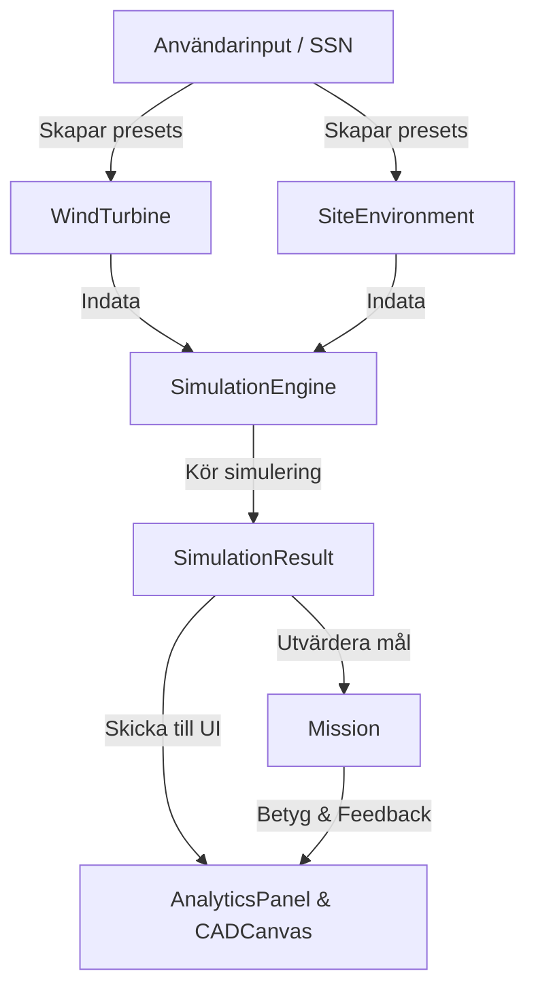

# Vindkraftssimulator

En modulär och pedagogisk CustomTkinter-applikation för simulering, dimensionering och analys av vindkraftverk. Verktyget är utformat för att lära studenter grundläggande fysikaliska, mekaniska och ekonomiska avvägningar inom vindkraftsteknik genom spelifierade uppdrag (Missions) och personnummer-baserad parametergenerering.

---

## Arkitektur & Dataflöde

Systemet bygger på **Domändriven design (DDD)** för att separera data från beräkningslogik och användargränssnitt, vilket förhindrar kodduplicering och underlättar automatiserad testning.



### 1. Domänmodeller (`Code/models/`)
* **`WindTurbine`**: Representerar vindkraftverkets geometri (diameter, navhöjd, soliditet, antal blad) samt val av drivlina (växellådsteknik och generator).
* **`SiteEnvironment`**: Innehåller platsens resurser (medelvind, ytråhet, stormbyar, årlig downtime) samt de ekonomiska spelreglerna (elpris, certifikat, ränta, inflation, livslängd).
* **`SimulationResult`**: En oföränderlig (`frozen=True`) dataclass som innehåller alla beräknade värden från simuleringen (AEP, kapacitetsfaktor, krafter, krävda väggtjocklekar, CAPEX/OPEX-detaljer och NPV-kassaflöden).

### 2. Beräkningsmotor (`Code/models/simulation.py`)
* **`SimulationEngine`**: En tillståndslös (stateless) motor som tar emot en `WindTurbine` och en `SiteEnvironment` och utför simuleringen i ett svep:
  1. **Vindprofil (Wind Shear)**: Beräknar vindhastigheten vid navhöjd utifrån logaritmiska vindprofiler.
  2. **Weibull-fördelning**: Skapar vindfördelningskurvan över årets 8760 timmar.
  3. **Energiproduktion**: Integrerar effektkurvan (med Betz gränser) för att beräkna årlig energiproduktion (AEP).
  4. **Hållfasthet (Alternativ A)**: Beräknar böjmomentet längs tornet under driftlaster och stormbyar. Dimensionerar tornets minsta väggtjocklek ($t_{\text{krävd}}$) för att hålla en **fast säkerhetsfaktor på 1.5** mot stålgränsen (160 MPa). Tornets totala vikt (massa) och CAPEX beräknas direkt utifrån denna tjocklek.
  5. **Ekonomi**: Beräknar CAPEX-komponenter, årliga driftskostnader (OPEX), elintäkter samt Net Present Value (NPV) med geometrisk serie över turbinens livslängd.

---

## Filstruktur

Projektets struktur är uppdelat i en tydlig Model-View-Controller-struktur under mappen `Code/`:

```text
uu_proj/
└── Code/
    ├── main.py                 # Startpunkt för applikationen
    ├── config.py               # Fysikaliska och ekonomiska konstanter
    │
    ├── models/                 # --- DOMÄN- och BERÄKNINGSMODELLER ---
    │   ├── turbine.py          # Turbin-modellen (egenskaper & geometri)
    │   ├── environment.py      # Miljö- och ekonomiska platsparametrar
    │   ├── simulation.py       # Fysik/ekonomi-motor & resultat-dataclass
    │   └── challenge.py        # Uppdragsdefinitioner & utvärdering
    │
    ├── utils/                  # --- HJÄLPFUNKTIONER ---
    │   └── ssn.py              # Personnummer-tolkare & validerare
    │
    └── gui/                    # --- CUSTOMTKINTER LAYOUT ---
        ├── app.py              # Huvudfönstret (kontrollerar state & koordinering)
        ├── console.py          # Vänsterpanelen (sliders och flikar)
        ├── canvas.py           # Mittenpanelen (CAD-skiss & turbinrotation)
        └── analytics.py        # Högerpanelen (Weibull/effektkurvor & tabeller)
```

---

## Gränssnittsstruktur (UI Structure)

Gränssnittet är uppdelat i ett trepanelssystem i CustomTkinter och använder ett **händelsestyrt gränssnittsmönster (Event-Driven UI)** där panelerna är frikopplade och kommunicerar via huvudkontrollern (`app.py`):

1. **Vänsterpanelen (`ConsolePanel` / `console.py`)**: 
   * Hanterar användarinmatning genom flikar (Physical Specs, Drivetrain, Scenario Conditions).
   * Sliders för elpris, livslängd, inflation och ränta är dolda/låsta under uppdragsläget och styrs av scenariot för att tvinga fram teknisk optimering.
   * Innehåller fält för personnummer (SSN) för att generera deterministiska miljöförutsättningar i Sandbox-läget.
2. **Mittenpanelen (`CADCanvas` / `canvas.py`)**:
   * Ritar upp en skalenlig teknisk ritning av turbinen med måttpilar (höjd, diameter) live när användaren drar i sliders.
   * Innehåller en animationsloop som roterar bladen (där rotationshastigheten beror på turbinens fysikaliska parametrar).
   * Visar röd varningsfärg på tornet vid överskridna konstruktionsgränser.
3. **Högerpanelen (`AnalyticsPanel` / `analytics.py`)**:
   * Innehåller "Commit & Run Simulation"-knappen med en kort tidsfördröjning (diagnostic loading bar) för att bryta trial-and-error-fiddling och uppmuntra till egna manuella beräkningar.
   * Ritar upp den matematiskt korrekta Weibull-kurvan och turbinens effektkurva.
   * Visar den finansiella rapporten (CAPEX-fördelning, intäkter, marginaler, NPV) samt en strukturell revisionslogg (Audit Log) som varnar för överskridna tillverknings- eller miljöregler.

---

## Spelregler & Uppdrag (Missions)

Drivlinans olika teknologier (Direct Drive vs. växellåda, samt synkron-, DFIG- eller asynkrongenerator) påverkar kostnad, underhåll (OPEX), driftstopp (downtime), verkningsgrad ($C_p$) och nacelle-vikt (vilket belastar tornet). Detta tvingar fram olika optimala geometrier och drivline-kombinationer i de olika uppdragen.

### Drivline-kompatibilitet
För att spegla verklig ingenjörskonst är vissa kombinationer blockerade i appen:
* **Asynchronous (SCIG)** kan **endast** användas med **High-Speed** växellåda.
* **DFIG** kan användas med **High-Speed** eller **Medium-Speed** växellåda.
* **Synchronous** är kompatibel med **alla** växellådsval (Direct Drive, Medium-Speed, High-Speed).

### 📋 Uppdragsöversikt och Parametrar

| Parameter | U1: Sandbox (Lillgrund) | U2: Arctic Gale (Dogger Bank) | U3: Gentle Breeze (Smöla/Skog) | U4: Community Co-op (Markbygden) |
| :--- | :--- | :--- | :--- | :--- |
| **avg_wind_10** | 7.0 m/s | 8.5 m/s | 4.5 m/s | 5.5 m/s |
| **roughness** | 0.2 mm | 0.2 mm | 500.0 mm | 30.0 mm |
| **survival_gust** | 59.5 m/s | 65.0 m/s | 50.0 m/s | 50.0 m/s |
| **k_factor** | 1.84 | 2.0 | 1.8 | 2.4 |
| **lifetime** | 25 år | 25 år | 25 år | 25 år |
| **downtime** | 5.0 % | 8.0 % | 4.0 % | 3.0 % |
| **capture_eff** ($C_p$) | 0.45 | 0.47 | 0.42 | 0.43 |
| **drivetrain_eff** | 0.94 | 0.95 | 0.93 | 0.92 |
| **electricity_price** | 55 €/MWh | 60 €/MWh | 50 €/MWh | 48 €/MWh |

### Särskilda Regler & Samhällskrav per Uppdrag:
* **Uppdrag 1 (Sandbox)**: Inga restriktioner för höjd eller tjocklek. Fritt fram att testa.
* **Uppdrag 2 (Arctic Gale)**: **Tornets bastjocklek max 100 mm** (fast SF 1.5). Inga höjdgränser. Mål: NPV > 0. (Optimalt: *Medium-Speed + DFIG*).
* **Uppdrag 3 (Gentle Breeze)**: **Totalhöjden (Tip Height = H + D/2) max 160 m**. Mål: AEP $\ge 1800\text{ MWh}$ och CAPEX < 5.0 M€. (Optimalt: *High-Speed + Synchronous* på grund av stark vindgradient).
* **Uppdrag 4 (Community Co-op)**: **Totalhöjd max 140 m** OCH **Diameter max 90 m** (buller- och skuggbegränsning). Mål: CAPEX < 3.8 M€ och NPV > 0. (Optimalt: *High-Speed + Asynchronous*).

---

## Projektplanering & Roadmap

Utvecklingen är uppdelad i fyra milstolpar (milestones) enligt [broader_plan.md](file:///home/gustavg/Projects/uu_proj/Tankar/New%20Format/broader_plan.md):

### Milstolpe 1: Beräkningsmotor & Konstanter (Klart)
* Centralisera alla fysikaliska och ekonomiska konstanter till `Code/config.py`.
* Implementera fullständiga formler för vindskjuvning, Weibull, Betz-effektkurva, balkböjning av tornet samt fullständiga CAPEX/OPEX/NPV-kalkyler i `Code/models/simulation.py`.

### Milstolpe 2: Modulär CustomTkinter GUI-integration (Pågående)
* Dela upp det monolitiska gränssnittet till de fristående klasserna i `Code/gui/`: `ConsolePanel`, `CADCanvas` och `AnalyticsPanel`.
* Koppla samman panelerna med händelsestyrda callbacks i `app.py` och säkerställa att ritningar och diagram uppdateras baserat på faktiska simulationsobjekt.
* Implementera uppdragsbegränsningar och drivline-kompatibilitet i gränssnittet.

### Milstolpe 3: Spelmekanik & SSN-logik (Nästa steg)
* Implementera `SSNGenerator` för personnummer-parsing.
* Bygga in de fyra uppdragens checklistor, utvärderingslogik och gränser (t.ex. totalhöjd, tjocklek, budget och simuleringsräknare).

### Milstolpe 4: Verification & Paketering
* Skriva enhetstester för att säkerställa att Python-beräkningarna matchar referenskalkylerna i Excel.
* Lägga till robust felhantering och paketera applikationen till en fristående `.exe`-fil med PyInstaller för distribution till studenterna.
