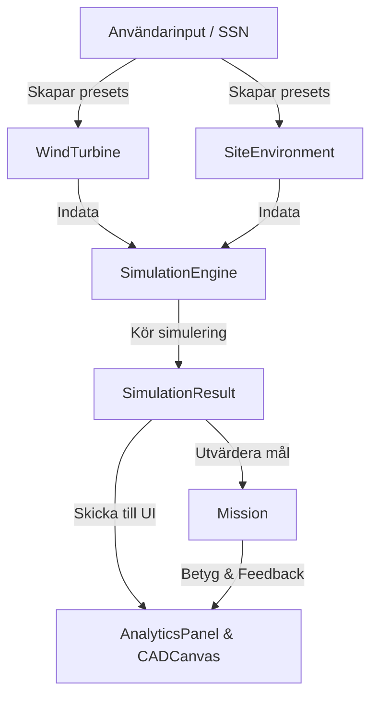

# Vindkraftssimulator (Challenge Mode)

En modulär och pedagogisk CustomTkinter-applikation för simulering, dimensionering och analys av vindkraftverk. Verktyget är utformat för att lära studenter grundläggande fysikaliska, mekaniska och ekonomiska avvägningar inom vindkraftsteknik genom spelifierade uppdrag (Missions) och personnummer-baserad parametergenerering.

---

## 🏗️ Arkitektur & Dataflöde




### 1. Domänmodeller (`Code/models/`)
* **`WindTurbine`**: Representerar vindkraftverkets geometri (diameter, navhöjd, soliditet, antal blad) samt val av drivlina (växellådsteknik och generator).
* **`SiteEnvironment`**: Innehåller platsens resurser (medelvind, ytråhet, stormbyar, årlig downtime) samt de ekonomiska spelreglerna (elpris, certifikat, ränta, inflation, livslängd).
* **`SimulationResult`**: En oföränderlig (`frozen=True`) dataclass som innehåller alla beräknade värden från simuleringen (AEP, kapacitetsfaktor, krafter, krävda väggtjocklekar, CAPEX/OPEX-detaljer och NPV-kassaflöden).

### 2. Beräkningsmotor (`Code/models/simulation.py`)
* **`SimulationEngine`**: En tillståndslös (stateless) motor som tar emot en `WindTurbine` och en `SiteEnvironment` och utför simuleringen i ett svep:
  1. **Vindprofil (Wind Shear)**: Beräknar vindhastigheten vid navhöjd utifrån logaritmiska vindprofiler.
  2. **Weibull-fördelning**: Skapar vindfördelningskurvan över årets 8760 timmar.
  3. **Energiproduktion**: Integrerar effektkurvan (med Betz gränser) för att beräkna årlig energiproduktion (AEP).
  4. **Hållfasthet (Alternativ A)**: Beräknar böjmomentet längs tornet under driftlaster och stormbyar ($65\text{ m/s}$). Dimensionerar tornets minsta väggtjocklek ($t_{\text{krävd}}$) för att hålla en **fast säkerhetsfaktor på 1.5** mot stålgränsen (160 MPa). Tornets totala vikt (massa) och CAPEX beräknas direkt utifrån denna tjocklek.
  5. **Ekonomi**: Beräknar CAPEX-komponenter, årliga driftskostnader (OPEX), elintäkter samt Net Present Value (NPV) med geometrisk serie över turbinens livslängd.

---

##  Filstruktur

Projektets struktur är uppdelat i en tydlig Model-View-Controller-struktur under mappen `Code/`:

```text
uu_proj/
└── Code/
    ├── main.py                 # Startpunkt för applikationen
    ├── config.py               # Fysikaliska och ekonomiska konstanter
    │
    ├── models/                 # --- DOMÄN- och BERÄKNINGSMODELLER ---
    │   ├── turbine.py          # Turbin-modellen (egenskaper & geometri)
    │   ├── environment.py      # Miljö- och ekonomiska platsparametrar
    │   ├── simulation.py       # Fysik/ekonomi-motor & resultat-dataclass
    │   └── challenge.py        # Uppdragsdefinitioner & utvärdering
    │
    ├── utils/                  # --- HJÄLPFUNKTIONER ---
    │   └── ssn.py              # Personnummer-tolkare & validerare
    │
    └── gui/                    # --- CUSTOMTKINTER LAYOUT ---
        ├── app.py              # Huvudfönstret (kontrollerar state & koordinering)
        ├── console.py          # Vänsterpanelen (sliders och flikar)
        ├── canvas.py           # Mittenpanelen (CAD-skiss & turbinrotation)
        └── analytics.py        # Högerpanelen (Weibull/effektkurvor & tabeller)
```

---

##  Gränssnittsstruktur (UI Structure)

Gränssnittet är uppdelat i ett trepanelssystem i CustomTkinter och använder ett **händelsestyrt gränssnittsmönster (Event-Driven UI)** där panelerna är frikopplade och kommunicerar via huvudkontrollern (`app.py`):

1. **Vänsterpanelen (`ConsolePanel` / `console.py`)**: 
   * Hanterar användarinmatning genom flikar (Physical Specs, Drivetrain, Scenario Conditions).
   * Sliders för elpris, livslängd, inflation och ränta är dolda/låsta under uppdragsläget och styrs av scenariot för att tvinga fram teknisk optimering.
   * Innehåller fält för personnummer (SSN) för att generera deterministiska miljöförutsättningar i Sandbox-läget.
2. **Mittenpanelen (`CADCanvas` / `canvas.py`)**:
   * Ritar upp en skalenlig teknisk ritning av turbinen med måttpilar (höjd, diameter) live när användaren drar i sliders.
   * Innehåller en animationsloop som roterar bladen (där rotationshastigheten beror på turbinens fysikaliska parametrar).
   * Visar röd varningsfärg på tornet vid överskridna konstruktionsgränser.
3. **Högerpanelen (`AnalyticsPanel` / `analytics.py`)**:
   * Innehåller "Commit & Run Simulation"-knappen med en kort tidsfördröjning (diagnostic loading bar) för att bryta trial-and-error-fiddling och uppmuntra till egna manuella beräkningar.
   * Ritar upp den matematiskt korrekta Weibull-kurvan och turbinens effektkurva.
   * Visar den finansiella rapporten (CAPEX-fördelning, intäkter, marginaler, NPV) samt en strukturell revisionslogg (Audit Log) som varnar för överskridna tillverknings- eller miljöregler.

---

##  Spelregler & Uppdrag (Missions)

Drivlinans olika teknologier (Direct Drive vs. växellåda, samt synkron-, DFIG- eller asynkrongenerator) påverkar kostnad, underhåll (OPEX), driftstopp (downtime), verkningsgrad ($C_p$) och nacelle-vikt (vilket belastar tornet). Detta ska tvinga fram olika optimala geometrier och drivline-kombinationer i de olika uppdragen:

### 📋 Uppdragsöversikt

| Uppdrag                | Miljö & Utmaning                                                                            | Särskilda Regler & Samhällskrav                                                                       |
| :--------------------- | :------------------------------------------------------------------------------------------ | :---------------------------------------------------------------------------------------------------- |
| **1. Sandbox**         | Valfritt testande                                                                           | Inga begränsningar på simuleringar eller mått.                                                        |
| **2. Arctic Gale**     | Offshore stormläge                                                                          | **Tornets bastjocklek max 100 mm** (tillverkningsgräns). Inga höjdgränser.                            |
| **3. Gentle Breeze**   | Lågvindsoptimering i skog. Mycket vind högre upp                                            | **Totalhöjd (Tip Height) max 160 m** (luftfarts- och visningsregler).                                 |
| **4. Community Co-op** | Lokal vindförening nära samhälle. Platt terräng (låg vindskjuvning). Stabil vind ($k=2.4$). | **Totalhöjd max 140 m** OCH **Diameter max 90 m** (buller- och skuggbegränsning). **CAPEX < 3.8 M€**. |

---

##  Projektplanering & Roadmap

Utvecklingen är uppdelad i fyra milstolpar (milestones) enligt [broader_plan.md](file:///home/gustavg/Projects/uu_proj/Tankar/New%20Format/broader_plan.md):

### Milstolpe 1: Beräkningsmotor & Konstanter (Klart)
* Centralisera alla fysikaliska och ekonomiska konstanter till `Code/config.py`.
* Implementera fullständiga formler för vindskjuvning, Weibull, Betz-effektkurva, balkböjning av tornet samt fullständiga CAPEX/OPEX/NPV-kalkyler i `Code/models/simulation.py`.

### Milstolpe 2: Modulär CustomTkinter GUI-integration (Pågående)
* Dela upp det monolitiska gränssnittet till de fristående klasserna i `Code/gui/`: `ConsolePanel`, `CADCanvas` och `AnalyticsPanel`.
* Koppla samman panelerna med händelsestyrda callbacks i `app.py` och säkerställa att ritningar och diagram uppdateras baserat på faktiska simulationsobjekt.
	* Sammankoppla med **environments** och sätt upp **constriants** för att klara nivån

### Milstolpe 3: Spelmekanik & SSN-logik (Nästa steg)
* Implementera `SSNGenerator` för personnummer-parsing.
* Bygga in de fyra uppdragens checklistor, utvärderingslogik och gränser (t.ex. totalhöjd, tjocklek, budget och simuleringsräknare).

### Milstolpe 4: Verifiering & Paketering
* Skriva enhetstester för att säkerställa att Python-beräkningarna matchar referenskalkylerna i Excel.
* Lägga till robust felhantering och paketera applikationen till en fristående `.exe`-fil med PyInstaller för distribution till studenterna.
